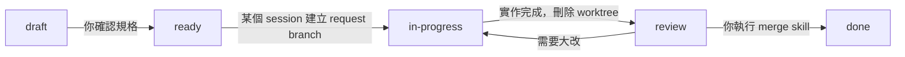

<h1 align="center">ss-workflow</h1>

<p align="center">
  建立在 gitflow 之上、以 request 為核心的開發流程，以 Claude Code plugin 的形式提供。
</p>

<p align="center">
  
  <a href="LICENSE"></a>
  <a href="https://code.claude.com/docs"></a>
  
</p>

<p align="center">
  <a href="README.md">English</a> | 繁體中文
</p>

一個 Claude Code plugin，在 gitflow 之上為 repo 建立以 request 為核心的開發流程。每個變更都從一個 request 檔開始，規格由你確認；agent 在獨立的 git worktree 裡實作，你在根目錄驗證和 review，再由 skill 依照固定的規則 merge 和 release。

- 每個變更都是一個 request 檔，規格（包含軟體架構）經你確認之前不會開始實作。
- Agent 在各自的 git worktree 裡實作，所以多個 session 可以平行處理多個 request。
- Verify、可選的 code review 和你的人工 review 都在根目錄的 request branch 上進行。
- Merge 和 release 依照固定的 gitflow 規則：`--no-ff` merge、tag 和推薦的版本號。
- 不相依任何一種專案形式：Visual Studio solution、Keil 專案、ESP32 firmware 或其他類型，用法都一樣。
- 沒有 remote 也能用，可以搭配任何 git remote，也可以搭配 GitHub 或 GitLab 的 merge request。由設定決定 agent 是自動 push、先詢問，還是完全不 push。
- 每個 request 都保留問過的問題和你的回答；每一份結果都會寫明什麼有跑、什麼失敗、什麼沒跑。

> [!WARNING]
> **狀態：0.5.0，早期版本。** 六個 skill 都已寫完，plugin manifest 也通過驗證，但整套流程還沒有在實際專案上完整跑過一次。

<details>
<summary>目錄</summary>

- [開始使用](#開始使用)
  - [需求](#需求)
  - [安裝](#安裝)
  - [快速開始](#快速開始)
- [Skills](#skills)
- [Request 的流程](#request-的流程)
- [Branching model](#branching-model)
- [Remote 與 push](#remote-與-push)
- [Init 之後的檔案結構](#init-之後的檔案結構)
- [專案形式](#專案形式)
- [更新](#更新)
- [開發這個 plugin](#開發這個-plugin)
- [授權](#授權)

</details>

## 開始使用

### 需求

- [Claude Code](https://code.claude.com/docs)
- git
- 選用：`gh` 或 `glab` CLI，用來在 GitHub 或 GitLab 發 merge request
- 你的專案自己的 toolchain 所需的工具。Plugin 本身不需要其中任何一項。

### 安裝

把這個 repo 加為 plugin marketplace，再安裝 plugin。在 Claude Code session 裡執行：

```text
/plugin marketplace add <owner>/ss-workflow
/plugin install ss-workflow@ss-workflow
```

把 `<owner>/ss-workflow` 換成 GitHub repo；其他平台請用完整的 git URL。

> [!TIP]
> 想讓專案的所有成員都取得這個 plugin，可以讓 `/ss-workflow:init` 把 marketplace 註冊到專案的 `.claude/settings.json`。

### 快速開始

```text
/ss-workflow:init                      設定 repo（回答問題）
/ss-workflow:new-req 加入深色主題      建立 request 並確認規格
/ss-workflow:check-req                 認領並在 worktree 實作
/ss-workflow:review                    在根目錄驗證和 review
/ss-workflow:merge                     驗收：關閉 request 並 merge 進 develop
/ss-workflow:release                   釋出新版本
```

## Skills

| Skill | 使用時機 | 在哪裡執行 | 做什麼 |
|-------|----------|------------|--------|
| `/ss-workflow:init` | 每個 repo 一次，plugin 更新後再跑一次 | 根目錄 | 建立檔案結構、git branch、`AGENTS.md` / `CLAUDE.md` 和 README。也能轉換既有專案，或升級由舊版建立的 repo。 |
| `/ss-workflow:new-req` | 有新功能、修正或其他變更 | 根目錄，`req/` branch | 撰寫 request 檔，跟你討論規格，你確認後以 `ready` 狀態 merge 進 `develop`。 |
| `/ss-workflow:check-req` | 想看有哪些待辦，或要開始、繼續實作 | 總覽和認領在根目錄；實作在 worktree | 列出所有 request、修復異常狀態、建立 branch 和 worktree 來認領一個 `ready` 的 request 並實作。完成後標為待 review 並刪除 worktree。 |
| `/ss-workflow:review` | 有實作完成的 request 在等你 | 根目錄，request branch | Verify：執行 build、測試和驗證 script。Code review（可選）：檢查這個 request 的變更有沒有 bug。Review：引導你人工驗證。小問題當場修正，需要大改則退回重做。 |
| `/ss-workflow:merge` | 你驗收了一個 request，或 release / hotfix 準備好了 | 根目錄 | 關閉 request 並 merge 它的 branch，為 release 和 hotfix 建立 tag，並刪除 branch。 |
| `/ss-workflow:release` | 要釋出新版本 | 根目錄 | 推薦版本號、建立 release branch、檢查未完成的工作、設定版本號，然後交給 release merge。 |

> [!NOTE]
> 根目錄指的是 repo 的主要 checkout。測試、script 和執行檔只在根目錄執行。在 worktree 裡執行程式的限制比較多，所以 agent 在 worktree 裡只寫程式並嘗試編譯。

每個 skill 都屬於 `ss-workflow` plugin，所以名稱以 `/ss-workflow:` 開頭。請一律輸入這個前綴：後面的名稱很短也很常見，其中像 `/init` 本身就是 Claude Code 的內建指令。

## Request 的流程



| Status | 意義 | 在哪裡進行 | 由誰設定 |
|--------|------|------------|----------|
| `draft` | 規格討論中 | 根目錄，`req/REQ-…` branch | `/ss-workflow:new-req` |
| `ready` | 你已確認規格，request 在 `develop` 上等待認領 | （無） | `/ss-workflow:new-req` |
| `in-progress` | 已認領，實作中 | worktree，request branch | `/ss-workflow:check-req` |
| `review` | 實作完成，worktree 已刪除、branch 保留；等待或正在 Verify 和 Review | 根目錄，request branch | `/ss-workflow:check-req`，接著 `/ss-workflow:review` |
| `done` | 已關閉，檔案在 `reqs/done/` | 根目錄 | `/ss-workflow:merge` |

一個 request 就是一個 Markdown 檔，例如 `reqs/REQ-0012-20260907-gui-button.md`。狀態只記錄在它的 YAML frontmatter 裡，你原始提供的內容會原封不動保留在 `## Original` 區段。

| 區段 | 內容 |
|------|------|
| `## Spec` | 確認過的規格：目標、範圍、架構、acceptance criteria、如何驗證、不包含的範圍 |
| `## Original` | 你原始提供的需求，不會被修改 |
| `## Q&A` | 每一個影響 request 的問題、你的原話回答和因此做出的決定，依發問順序記錄。還沒回答的問題寫 `A: (pending)`。 |
| `## Notes` | Assumption、implementation summary、行為變更，以及 Verify、code review、Review 的結果，都帶日期 |

- Draft 只存在它的 `req/` branch 上，`develop` 上只有你確認過的 request。
- `## Q&A` 裡沒有 pending 的問題，request 才能變成 `ready`。已回答的紀錄不會被改寫：決定改變時是新增一筆。
- 建立 request branch 就是認領：git 保證同名的 branch 只能建立一次，所以兩個 session 不會認領到同一個 request。
- Verify 或 Review 發現的小問題，直接在根目錄修正。需要大改的 request 會退回 `in-progress`，回到 worktree 實作。
- Review 期間你可以手動修改程式碼。`/ss-workflow:review` 會列出所有未 commit 的變更（包含新增的檔案），問你每一項是什麼：屬於這個 request（commit）、產生的檔案（加入 `.gitignore`）或不要的（捨棄）。Verify 只有在乾淨的工作目錄上跑才算數。
- Code review 是可選的。`/ss-workflow:review` 在 Verify 通過後會問你要不要跑，並用 Claude Code 的 `/code-review` 只檢查這個 request 的變更 (`origin/develop...<request branch>`)。同一次 review 期間之後也可以再要求。結果記錄在 request 的 `## Notes`。
- 結果如實回報。每一項檢查都記為 `passed`、`failed`、`did not run` 或 `not configured`，implementation summary 會列出沒做完的部分。沒跑的檢查不會記成通過。
- 改到會影響 agent 行為的檔案（`AGENTS.md`、`CLAUDE.md`、`.claude/`、skill，或 `agent-files` 設定列出的路徑）時，會當成行為變更來 review：request 會記錄 agent 之前怎麼做、現在怎麼做，由你在 Review 逐項確認。這類變更 build 和測試都看不出來。

## Branching model

| Branch | 從哪裡開 | Merge 到哪裡 | 範例 |
|--------|----------|--------------|------|
| 規格討論 | `develop` | `develop` | `req/REQ-0012-gui-button` |
| Request | `develop` | `develop` | `feat/REQ-0012-gui-button` |
| Release | `develop` | `master` 和 `develop`，並建立 tag | `release/v1.0.0-beta1` |
| Hotfix | `master` | `master` 和 `develop`，並建立 tag | `hotfix/v1.0.1` |

- `master`（或 `main`）只接收 release 和 hotfix。v1.0.0 之前，也允許把 `develop` 直接 merge 進來。
- Request 和 hotfix branch 都在 `.claude/worktrees/` 底下的 git worktree 實作，所以多個 session 可以平行實作多個 request。worktree 只在實作期間存在。
- 規格討論、review、merge 和 release 共用根目錄，所以同一時間只能進行其中一項。
- 所有 merge 都用 `--no-ff`。可以在 local merge，也可以透過 GitHub 或 GitLab 的 merge request。

## Remote 與 push

這個工作流不需要 remote。沒有 remote 時，本機的 `develop` 就是已確認 request 的所在，建立本機 branch 就是認領，所有 branch 都在本機 merge；所有 fetch、pull、push 的步驟都會略過。

有 remote 時，由 root `AGENTS.md` 的 `push-policy` 設定決定 agent 會 push 什麼：

| `push-policy` | Agent 的行為 | 適合 |
|---------------|--------------|------|
| `auto`（預設） | 每次 commit 後 push 自己的 topic branch；你要求 merge 之後 push `develop` | 多台機器或多個 session 共用 remote：認領和狀態變更立刻看得到 |
| `ask` | 只在本機 commit，每次執行 skill 第一次要 push 前先問你 | 想先看過要送出去的內容 |
| `never` | 不 push，也不刪除 remote branch。每個 skill 結束時列出你需要 push 的項目。 | 對「誰可以發佈」有嚴格規定的環境 |

- 不論設定為何，agent 在 push `master` 或 tag 之前一定會再問一次，不會 force-push，也不會在確認已 merge 之前刪除 branch。
- 還沒 push 之前，認領只在這台機器上有效。
- `remote-platform` 是另一個設定，只表示能不能發 merge request（`github`、`gitlab`）。其他 remote 一律是 `none`，branch 在本機 merge 後再 push。
- Remote 拒絕 push 到受保護的 branch 時，skill 不會繞過：改發 merge request，或停下來告訴你需要在 remote 上 merge 什麼。

## Init 之後的檔案結構

```text
repo/
├─ AGENTS.md, CLAUDE.md      給 agent 看的流程規則（CLAUDE.md 只 import AGENTS.md）
├─ README.md, README-zh-TW.md
├─ src/                      主要專案檔和原始碼，一個專案（或模組）一個資料夾，
│                            各有 README.md
├─ reqs/                     未完成的 request；完成的在 reqs/done/
├─ docs/                     專案規格、developer 文件、知識庫
├─ external/                 submodule 和第三方 binary
├─ tests/                    測試專案（可選）
└─ samples/                  sample / demo 專案（可選）
```

`reqs/`、`docs/` 和 agent 檔案是工作流必要的部分。程式碼相關的資料夾只是預設值：init 會問你要保留哪些、source 資料夾叫什麼名字，既有專案也可以維持原本的結構。

## 專案形式

Plugin 不內建任何 toolchain 的範本或指令。init 時你用自己的話描述專案類型，agent 提出下表各項的建議值讓你確認。這些內容存在專案的 `AGENTS.md` 裡，所有 skill 都從那裡讀取。

| 內容 | 存放位置 |
|------|----------|
| 主要專案檔、版本號來源，以及 setup、build、test、verify 指令 | root `AGENTS.md` 的「Workflow settings」 |
| 其他會影響 agent 行為的檔案，例如產品內附的 prompt 檔（`agent-files`） | root `AGENTS.md` 的「Workflow settings」 |
| 需要的工具、不在 `PATH` 上的工具怎麼找、已知限制 | root `AGENTS.md` 的「Toolchain」 |
| 新檔案和專案如何加入 build、哪些是產生的檔案、命名慣例 | source 資料夾 `AGENTS.md` 的「Project rules」 |
| 要忽略的 build 輸出和本機檔案 | `.gitignore` |

> [!NOTE]
> 指令可以留空，例如只能在 IDE 裡 build 的專案。這時 skill 會略過該步驟並回報「未設定」，不會自行編造指令。

## 更新

Marketplace 會拿 `.claude-plugin/plugin.json` 的 `version` 跟已安裝的版本比對。

```text
/plugin marketplace update ss-workflow
```

> [!IMPORTANT]
> Plugin 更新不會改動 init 在你專案裡產生的檔案。更新之後，請在專案裡再執行一次 `/ss-workflow:init`。它會比對 root `AGENTS.md` 記錄的 `ss-workflow-version` 和 plugin 版本，只更新標記為 `<!-- ss-workflow:managed -->` 的區段，區段以外你自己寫的內容不會被改動。

有些版本需要的不只是新的規則文字，例如新增設定或改變 request 檔的格式。這類版本都會附一份 migration 檔 `skills/init/migrations/<version>.md`。升級時會從你 repo 記錄的版本開始，依版本順序逐一套用到已安裝的版本。每一份都會先告訴你工作流的行為有什麼不同，再提出 managed 區段以外需要的修改；沒有你的回答，不會動那些內容。

## 開發這個 plugin

```text
.claude-plugin/
├─ plugin.json               plugin manifest；"version" 是唯一的版本來源
└─ marketplace.json          讓這個 repo 同時是自己的 marketplace
skills/
├─ init/                     SKILL.md、references/、templates/、migrations/
├─ new-req/                  SKILL.md
├─ check-req/                SKILL.md、references/
├─ review/                   SKILL.md
├─ merge/                    SKILL.md、references/
└─ release/                  SKILL.md、references/
tests/git-sequences.sh       檢查各 skill 規定的 git 步驟
tests/migrations.sh          檢查範本有變更時是否附了 migration 檔
ss-workflow-skill.md         設計規格
```

驗證 manifest，以及在單一 session 從工作目錄載入 plugin：

```bash
claude plugin validate .
```

```bash
claude --plugin-dir /path/to/ss-workflow
```

這些 skill 依賴 git 的特定行為：branch 如何認領 request、關閉的 request 如何進到 `develop`、hotfix 如何 merge。這支 script 會在暫存的沙盒裡跑這些指令並檢查結果。它測的是 git，不是 agent。修改 skill 的 git 步驟後請重跑一次：

```bash
bash tests/git-sequences.sh
```

`skills/init/templates/` 底下的檔案最後會出現在別的 repo 裡，plugin 更新碰不到它們。新增設定、改變 request 檔格式、搬動產生的檔案、改 skill 名稱，或改變工作流行為的版本，都需要附 migration 檔。什麼情況需要、格式怎麼寫，見 [skills/init/migrations/README.md](skills/init/migrations/README.md)。範本自上一個 release tag 之後有變更，卻沒有更新版本的 migration 檔時，這支 script 會失敗：

```bash
bash tests/migrations.sh
```

> [!IMPORTANT]
> 發佈變更時，要遞增 `.claude-plugin/plugin.json` 的 `version`，並同步更新兩份 README 開頭的版本 badge 和狀態說明。版本沒有變，已安裝的副本就不會更新。Migration 檔以該版本命名。

各個 skill 背後的設計決定記錄在 [ss-workflow-skill.md](ss-workflow-skill.md)。

## 授權

MIT，詳見 [LICENSE](LICENSE)。
