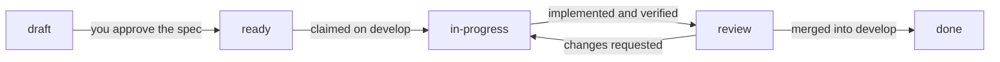

English | [繁體中文](README-zh-TW.md)

# ss-workflow

A Claude Code plugin that gives a repository a request-driven development workflow on
top of gitflow. Every change starts as a request file, is implemented in its own git
worktree, is reviewed by the developer, and is then merged and released by skills that
follow the same rules every time.

> **Status: 0.1.0, early.** The five skills are written and the plugin manifest
> validates, but the workflow has not yet been run end to end on a real project.

## Skills

| Skill | When to use it | What it does |
|-------|----------------|--------------|
| `/ss-workflow-init` | Once per repository, and again after a plugin update | Creates the folder layout, the git branches, `AGENTS.md` / `CLAUDE.md`, and the README files. Converts an existing project, or upgrades a repository made by an older version. |
| `/ss-workflow-new-req` | You have a new feature, fix, or other change | Creates a request file in `reqs/`, discusses the spec with you, and marks it `ready` when you approve. |
| `/ss-workflow-check-req` | You want to see what is pending, or start or continue work | Lists the open requests, repairs inconsistent ones, claims a `ready` request into its own worktree, and implements it. In a request worktree, it resumes the work or asks about the review. |
| `/ss-workflow-merge` | A request is reviewed, or a release or hotfix is ready | Merges the branch by its kind, creates the tag for releases and hotfixes, and removes the worktree and the branches. |
| `/ss-workflow-release` | You want to release a new version | Recommends the version, creates the release branch, checks for unfinished work, sets the version number, and hands over to the release merge. |

Each skill belongs to the `ss-workflow` plugin, so its full name is
`/ss-workflow:ss-workflow-init`, and so on. Claude Code also accepts the short name
shown above when no other skill uses it.

## How a request moves



| Status | Meaning | Set by |
|--------|---------|--------|
| `draft` | The spec is under discussion | `/ss-workflow-new-req` |
| `ready` | You approved the spec; the request waits to be claimed | `/ss-workflow-new-req` |
| `in-progress` | Claimed; being implemented in a worktree | `/ss-workflow-check-req` |
| `review` | Implemented; waiting for your review | `/ss-workflow-check-req` |
| `done` | Closed; the file is in `reqs/done/` | `/ss-workflow-merge` |

A request is one Markdown file, `reqs/REQ-0012-20260907-gui-button.md`. Its YAML
frontmatter is the only place that holds its state, and your original text is kept
unchanged in its `## Original` section.

## Branching model

| Branch | Created from | Merges into | Example |
|--------|--------------|-------------|---------|
| Request | `develop` | `develop` | `feat/REQ-0012-gui-button` |
| Release | `develop` | `master` and `develop`, plus a tag | `release/v1.0.0-beta1` |
| Hotfix | `master` | `master` and `develop`, plus a tag | `hotfix/v1.0.1` |

- `master` (or `main`) only receives releases and hotfixes. Before v1.0.0, `develop`
  may also be merged into it directly.
- Request and hotfix branches are implemented in git worktrees under
  `.claude/worktrees/`, so several sessions can work on several requests in parallel.
- Every merge uses `--no-ff`. A branch can be merged locally, or through a merge
  request on GitHub or GitLab.

## Repository layout after init

```
repo/
├─ AGENTS.md, CLAUDE.md      workflow rules for agents (CLAUDE.md imports AGENTS.md)
├─ README.md, README-zh-TW.md
├─ Directory.Build.props     the single version source (.NET projects)
├─ src/                      source projects, one folder each, each with a README.md
├─ reqs/                     open requests; finished ones in reqs/done/
├─ docs/                     project spec, developer docs, knowledge base
├─ external/                 submodules and third-party binaries
├─ tests/                    test projects (optional)
└─ samples/                  sample and demo projects (optional)
```

The layout is designed around Visual Studio / .NET projects. For other project types,
init asks which parts to keep.

## Requirements

- [Claude Code](https://code.claude.com/docs)
- git
- Optional: the `gh` or `glab` CLI, for merge requests on GitHub or GitLab
- Optional: the .NET SDK, for .NET projects

## Installation

Add this repository as a plugin marketplace, then install the plugin. Run these inside
a Claude Code session:

```
/plugin marketplace add <owner>/ss-workflow
/plugin install ss-workflow@ss-workflow
```

Replace `<owner>/ss-workflow` with the GitHub repository, or use the full git URL for
another host.

To let everyone who works in a project get the plugin, `/ss-workflow-init` can
register the marketplace in the project's `.claude/settings.json`.

## Quick start

```
/ss-workflow-init                      set up the repository (answer the questions)
/ss-workflow-new-req add a dark theme  create a request and agree on its spec
/ss-workflow-check-req                 claim it and implement it in a worktree
/ss-workflow-merge                     after your review, merge it into develop
/ss-workflow-release                   release a new version
```

## Updating

The marketplace compares the `version` in `.claude-plugin/plugin.json` with the
installed version.

```
/plugin marketplace update ss-workflow
```

A plugin update does not change the files that init generated in your project. After
an update, run `/ss-workflow-init` in the project again. It compares the
`ss-workflow-version` recorded in the root `AGENTS.md` with the plugin version, and
updates only the blocks marked `<!-- ss-workflow:managed -->`. Your own text outside
those blocks stays as it is.

## Developing this plugin

```
.claude-plugin/
├─ plugin.json               plugin manifest; "version" is the single version source
└─ marketplace.json          makes this repository its own marketplace
skills/
├─ ss-workflow-init/         SKILL.md, references/, templates/
├─ ss-workflow-new-req/      SKILL.md
├─ ss-workflow-check-req/    SKILL.md, references/
├─ ss-workflow-merge/        SKILL.md, references/
└─ ss-workflow-release/      SKILL.md, references/
ss-workflow-skill.md         the design spec (Traditional Chinese)
```

Validate the manifests, and load the plugin from the working copy for one session:

```bash
claude plugin validate .
```

```bash
claude --plugin-dir /path/to/ss-workflow
```

When you publish a change, raise `version` in `.claude-plugin/plugin.json`. Without a
new version, installed copies do not update.

The design decisions behind the skills are recorded in
[ss-workflow-skill.md](ss-workflow-skill.md).

## License

MIT
