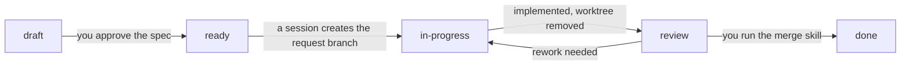

<h1 align="center">ss-workflow</h1>

<p align="center">
  A request-driven development workflow on top of gitflow, as a Claude Code plugin.
</p>

<p align="center">
  
  <a href="LICENSE"></a>
  <a href="https://code.claude.com/docs"></a>
  
</p>

<p align="center">
  English | <a href="README-zh-TW.md">繁體中文</a>
</p>

A Claude Code plugin that gives a repository a request-driven development workflow on
top of gitflow. Every change starts as a request file whose spec you approve. An agent
implements it in its own git worktree, you verify and review it in the root checkout,
and skills merge and release it by the same rules every time.

- Every change is a request file, and nothing is implemented before you approve its
  spec, including the software architecture.
- Agents implement in separate git worktrees, so several sessions can work on several
  requests in parallel.
- Verify, an optional code review, and your manual review happen in the root checkout,
  on the request branch.
- Merges and releases follow fixed gitflow rules: `--no-ff` merges, tags, and a
  recommended version number.
- It does not depend on a project type: a Visual Studio solution, a Keil project, an
  ESP32 firmware, or anything else works the same way.
- It works locally, or with merge requests on GitHub or GitLab.

> [!WARNING]
> **Status: 0.2.0, early.** The six skills are written and the plugin manifest
> validates, but the workflow has not yet been run end to end on a real project.

<details>
<summary>Table of contents</summary>

- [Getting started](#getting-started)
  - [Requirements](#requirements)
  - [Installation](#installation)
  - [Quick start](#quick-start)
- [Skills](#skills)
- [How a request moves](#how-a-request-moves)
- [Branching model](#branching-model)
- [Repository layout after init](#repository-layout-after-init)
- [Project types](#project-types)
- [Updating](#updating)
- [Developing this plugin](#developing-this-plugin)
- [License](#license)

</details>

## Getting started

### Requirements

- [Claude Code](https://code.claude.com/docs)
- git
- Optional: the `gh` or `glab` CLI, for merge requests on GitHub or GitLab
- The tools of your project's own toolchain. The plugin itself needs none of them.

### Installation

Add this repository as a plugin marketplace, then install the plugin. Run these inside
a Claude Code session:

```text
/plugin marketplace add <owner>/ss-workflow
/plugin install ss-workflow@ss-workflow
```

Replace `<owner>/ss-workflow` with the GitHub repository, or use the full git URL for
another host.

> [!TIP]
> To let everyone who works in a project get the plugin, `/ss-workflow-init` can
> register the marketplace in the project's `.claude/settings.json`.

### Quick start

```text
/ss-workflow-init                      set up the repository (answer the questions)
/ss-workflow-new-req add a dark theme  create a request and agree on its spec
/ss-workflow-check-req                 claim it and implement it in a worktree
/ss-workflow-review                    verify it and review it in the root checkout
/ss-workflow-merge                     accept it: close it and merge it into develop
/ss-workflow-release                   release a new version
```

## Skills

| Skill | When to use it | Where it runs | What it does |
|-------|----------------|---------------|--------------|
| `/ss-workflow-init` | Once per repository, and again after a plugin update | Root checkout | Creates the folder layout, the git branches, `AGENTS.md` / `CLAUDE.md`, and the README files. Converts an existing project, or upgrades a repository made by an older version. |
| `/ss-workflow-new-req` | You have a new feature, fix, or other change | Root checkout, on a `req/` branch | Writes the request file, discusses the spec with you, and merges it into `develop` as `ready` when you approve. |
| `/ss-workflow-check-req` | You want to see what is pending, or start or continue an implementation | Root checkout for the overview and the claim; a worktree for the implementation | Lists all requests, repairs inconsistent ones, claims a `ready` request by creating its branch and worktree, and implements it. Then it marks the request for review and removes the worktree. |
| `/ss-workflow-review` | An implemented request waits for you | Root checkout, on the request branch | Verify: runs the build, the tests, and the verification scripts. Code review (optional): reads the request's changes for bugs. Review: guides you through the manual check. Applies small fixes, or sends the request back for rework. |
| `/ss-workflow-merge` | You accept a reviewed request, or a release or hotfix is ready | Root checkout | Closes the request and merges its branch, creates the tag for releases and hotfixes, and deletes the branches. |
| `/ss-workflow-release` | You want to release a new version | Root checkout | Recommends the version, creates the release branch, checks for unfinished work, sets the version number, and hands over to the release merge. |

> [!NOTE]
> The root checkout is the repository's primary working tree. Tests, scripts, and
> executables only run there. In a worktree, the agent writes code and tries to compile
> it, because running things in a worktree is more restricted.

Each skill belongs to the `ss-workflow` plugin, so its full name is
`/ss-workflow:ss-workflow-init`, and so on. Claude Code also accepts the short name
shown above when no other skill uses it.

## How a request moves



| Status | Meaning | Where the work happens | Set by |
|--------|---------|------------------------|--------|
| `draft` | The spec is under discussion | Root checkout, on a `req/REQ-…` branch | `/ss-workflow-new-req` |
| `ready` | You approved the spec; the request is on `develop` and waits to be claimed | (nothing) | `/ss-workflow-new-req` |
| `in-progress` | Claimed; being implemented | A worktree, on the request branch | `/ss-workflow-check-req` |
| `review` | Implemented; the worktree is removed and the branch is kept; waiting for or under Verify and Review | Root checkout, on the request branch | `/ss-workflow-check-req`, then `/ss-workflow-review` |
| `done` | Closed; the file is in `reqs/done/` | Root checkout | `/ss-workflow-merge` |

A request is one Markdown file, `reqs/REQ-0012-20260907-gui-button.md`. Its YAML
frontmatter is the only place that holds its state, and your original text is kept
unchanged in its `## Original` section.

- A draft only exists on its `req/` branch. `develop` only holds requests you approved.
- Creating the request branch is the claim: git creates a branch name only once, so
  two sessions cannot claim the same request.
- Small problems found during Verify or Review are fixed in the root checkout. A
  request that needs larger rework goes back to `in-progress` and into a worktree.
- You can change code by hand during a review. `/ss-workflow-review` lists every
  uncommitted change, new files included, and asks you what each one is: part of the
  request (committed), a generated file (added to `.gitignore`), or unwanted
  (discarded). A Verify result only counts when it ran on a clean working tree.
- A code review is optional. `/ss-workflow-review` offers it after Verify passed, and
  runs Claude Code's `/code-review` on the changes of the request only
  (`origin/develop...<request branch>`). You can also ask for it later in the same
  review. Its result is recorded in the request's `## Notes`.

## Branching model

| Branch | Created from | Merges into | Example |
|--------|--------------|-------------|---------|
| Spec discussion | `develop` | `develop` | `req/REQ-0012-gui-button` |
| Request | `develop` | `develop` | `feat/REQ-0012-gui-button` |
| Release | `develop` | `master` and `develop`, plus a tag | `release/v1.0.0-beta1` |
| Hotfix | `master` | `master` and `develop`, plus a tag | `hotfix/v1.0.1` |

- `master` (or `main`) only receives releases and hotfixes. Before v1.0.0, `develop`
  may also be merged into it directly.
- Request and hotfix branches are implemented in git worktrees under
  `.claude/worktrees/`, so several sessions can implement several requests in
  parallel. A worktree only lives during the implementation.
- Spec discussions, reviews, merges, and releases share the root checkout, so only one
  of them runs at a time.
- Every merge uses `--no-ff`. A branch can be merged locally, or through a merge
  request on GitHub or GitLab.

## Repository layout after init

```text
repo/
├─ AGENTS.md, CLAUDE.md      workflow rules for agents (CLAUDE.md imports AGENTS.md)
├─ README.md, README-zh-TW.md
├─ src/                      the main project file and the source code, one folder
│                            per project or module, each with a README.md
├─ reqs/                     open requests; finished ones in reqs/done/
├─ docs/                     project spec, developer docs, knowledge base
├─ external/                 submodules and third-party binaries
├─ tests/                    test projects (optional)
└─ samples/                  sample and demo projects (optional)
```

`reqs/`, `docs/`, and the agent files are what the workflow needs. The code folders
are a default: init asks which ones to keep and what the source folder is called, and
an existing project can keep its own layout.

## Project types

The plugin ships no templates or commands for any toolchain. During init you describe
the project type in your own words, and the agent proposes the values below for you
to confirm. They are stored in the project's `AGENTS.md`, and every skill reads them
from there.

| What | Where it is stored |
|------|--------------------|
| Main project file, version source, and the setup, build, test, and verify commands | "Workflow settings" in the root `AGENTS.md` |
| Required tools, how to find tools that are not on `PATH`, known limits | "Toolchain" in the root `AGENTS.md` |
| How new files and projects are registered with the build, generated files, naming | "Project rules" in the source folder's `AGENTS.md` |
| Build output and local files to ignore | `.gitignore` |

> [!NOTE]
> A command may stay empty, for example when a project can only be built inside an
> IDE. The skills then skip that step and report it as "not configured". They do not
> invent a command.

## Updating

The marketplace compares the `version` in `.claude-plugin/plugin.json` with the
installed version.

```text
/plugin marketplace update ss-workflow
```

> [!IMPORTANT]
> A plugin update does not change the files that init generated in your project. After
> an update, run `/ss-workflow-init` in the project again. It compares the
> `ss-workflow-version` recorded in the root `AGENTS.md` with the plugin version, and
> updates only the blocks marked `<!-- ss-workflow:managed -->`. Your own text outside
> those blocks stays as it is.

## Developing this plugin

```text
.claude-plugin/
├─ plugin.json               plugin manifest; "version" is the single version source
└─ marketplace.json          makes this repository its own marketplace
skills/
├─ ss-workflow-init/         SKILL.md, references/, templates/
├─ ss-workflow-new-req/      SKILL.md
├─ ss-workflow-check-req/    SKILL.md, references/
├─ ss-workflow-review/       SKILL.md
├─ ss-workflow-merge/        SKILL.md, references/
└─ ss-workflow-release/      SKILL.md, references/
tests/git-sequences.sh       checks the git steps that the skills prescribe
ss-workflow-skill.md         the design spec (Traditional Chinese)
```

Validate the manifests, and load the plugin from the working copy for one session:

```bash
claude plugin validate .
```

```bash
claude --plugin-dir /path/to/ss-workflow
```

The skills rely on git behaving in specific ways: how a branch claims a request, how
a closed request reaches `develop`, how a hotfix is merged. This script runs those
command sequences in a temporary sandbox and checks the results. It tests git, not
the agent. Run it again when you change the git steps of a skill:

```bash
bash tests/git-sequences.sh
```

> [!IMPORTANT]
> When you publish a change, raise `version` in `.claude-plugin/plugin.json`, and the
> version badge and the status line at the top of both README files. Without a new
> version, installed copies do not update.

The design decisions behind the skills are recorded in
[ss-workflow-skill.md](ss-workflow-skill.md).

## License

MIT. See [LICENSE](LICENSE).
